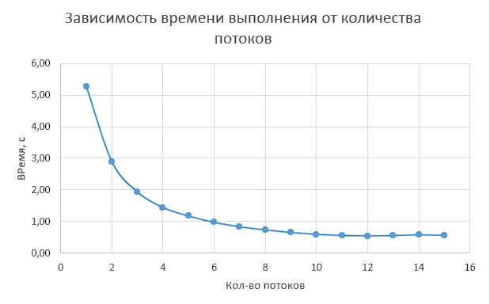
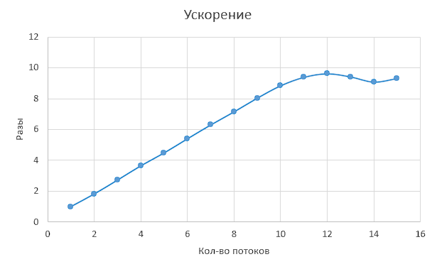
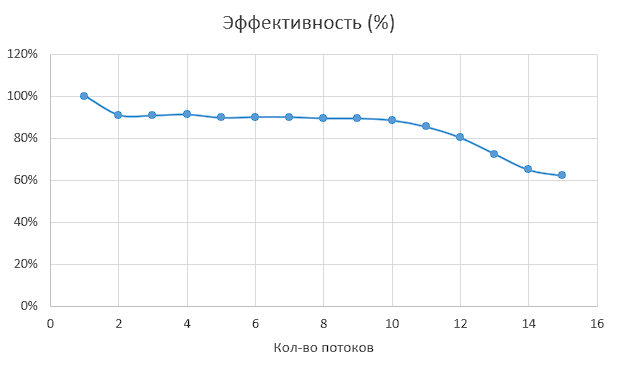
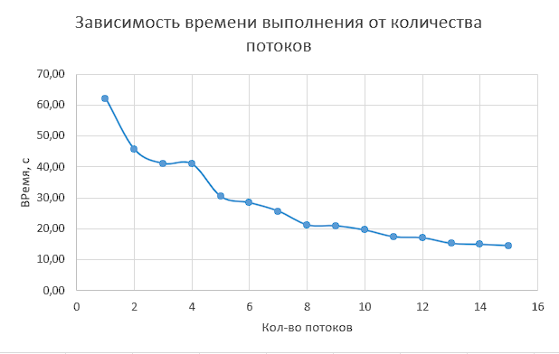
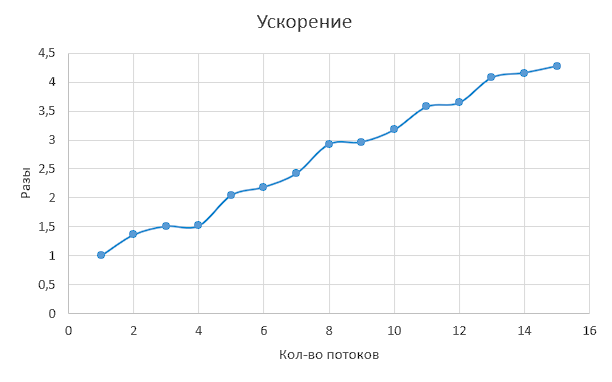
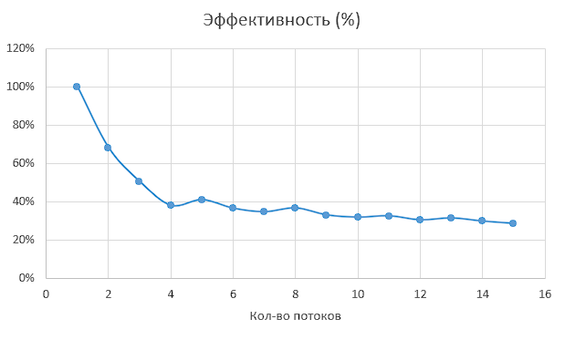
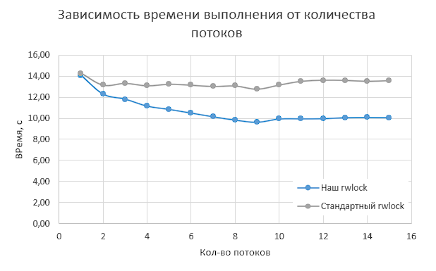
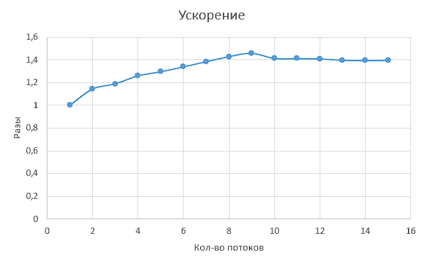

<h1 align="center">
Thread lab 1
</h1>

Выполнили: Козин Борис (21пи-3), Столетов Максим (21пи-2), Гурьянов Илья (21пми-1)

Все замеры проводились на процессоре с 6 физическими ядрами и 12 потоками.

## Задание 1 (Вычисление числа ПИ методом Монте-Карло)

### Описание алгоритма

Для вычисления числа ПИ генерируются N точек внутри квадрата со стороной 2.
В этот квадрат вписана окружность с радиусом 1\. Вероятность того, что случайная точка попадет в окружность
пропорциональна отношению площадей фигур или же π/4.

Программа разделяет кол-во точек на M потоков, каждый из которых выполняет свою часть работы.
После завершения работы, результаты объединяются и считается число π.

### Оценка работы алгоритма

|  |  |
|:-------------------------:|:-------------------------:|
|  |  |

### Реализованные функции

Функции хранятся в папке Task1.  
Для запуска используется `TASK1_run`, которая принимает число бросков и потоков.  
После этого создаются потоки, в которых работает функция `monte_carlo_pi`, в которой генерируются точки
с использованием потокобезопасной функции `my_drand`.

## Задание 2 (Вычисление множества Мандельброта)

### Описание алгоритма

Сначала определяется область, в которой будет проводиться расчет множества (по умолчанию -2, 1, -1, 1),
а также кол-во точек. После этого создается прямоугольная сетка из точек, кол-во точек в сетке будет
меньше или равно введенному кол-ву точек.  
Так же, чтобы была возможность создать большое кол-во точек, в программу вводится `batch_size`, который
используется для разделения общего числа точек на небольшие кусочки.  
После этого, для каждого потока выделяется свой набор точек и вычисляется скорость увеличения модуля числа.  
При не достижении за заданное число итераций (по умолчанию 1000) математической границы (`|z| < 2`) точка
считается принадлежащей множеству (и окрашивается черным), в противном случае окрашивается цветом,
соответствующим скорости увеличения ее модуля.

### Оценка работы алгоритма

|  |  |
|:-------------------------:|:-------------------------:|
|  |  |

### Реализованные функции

Функции хранятся в папке Task1.  
Для изменения области отрисовки используется функция `TASK2_set_borders`, которая принимает координаты x0, x1, y0, y1.  
Для изменения максимального кол-ва итераций используется функция `TASK2_set_iter`, которая принимает новое кол-во
итераций.  
Для запуска используется `TASK2_run`, которая принимает число точек, `batch_size` и кол-во потоков.
В этой функции происходит генерация точек, создание файла, в котором хранятся введенные параметры и запускается функция
`mandelbrot_set`, в которой и происходит вычисление множества. После этого полученные значения сохраняются в файлы (для
каждого `batch` создастся столько файлов, сколько было потоков, это нужно для ускорения сохранения).  
Если 'batch_size' меньше, чем общее кол-во точек, то процесс повторяется.
