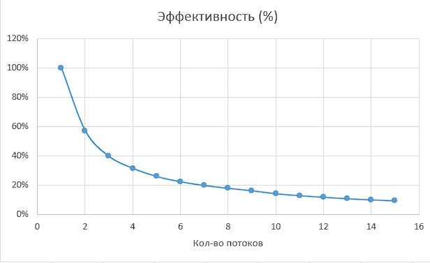

<h1 align="center">
Thread lab 1
</h1>

Все замеры проводились на процессоре с 6 физическими ядрами и 12 потоками. 
Выполнили: Козин Борис (21пи-3), Столетов Максим (21пи-2), Гурьянов Илья (21пми-1)

## Задание 1 (Вычисление числа ПИ методом Монте-Карло)

### Описание алгоритма

Для вычисления числа ПИ генерируются N точек внутри квадрата со стороной 2.
В этот квадрат вписана окружность с радиусом 1\. Вероятность того, что случайная точка попадет в окружность
пропорциональна отношению площадей фигур или же π/4.

Программа разделяет кол-во точек на M потоков, каждый из которых выполняет свою часть работы.
После завершения работы, результаты объединяются и считается число π.

### Оценка работы алгоритма

|  |  |
|:-------------------------:|:-------------------------:|
|  |                           |

### Реализованные функции

Функции хранятся в папке Task1.  
Для запуска используется `TASK1_run`, которая принимает число бросков и потоков.  
После этого создаются потоки, в которых работает функция `monte_carlo_pi`, в которой генерируются точки
с использованием потокобезопасной функции `my_drand`.

## Задание 2 (Вычисление множества Мандельброта)

### Описание алгоритма

Сначала определяется область, в которой будет проводиться расчет множества (по умолчанию -2, 1, -1, 1),
а также кол-во точек. После этого создается прямоугольная сетка из точек, кол-во точек в сетке будет
меньше или равно введенному кол-ву точек.  
Так же, чтобы была возможность создать большое кол-во точек, в программу вводится `batch_size`, который
используется для разделения общего числа точек на небольшие кусочки.  
После этого, для каждого потока выделяется свой набор точек и вычисляется скорость увеличения модуля числа.  
При не достижении за заданное число итераций (по умолчанию 1000) математической границы (`|z| < 2`) точка
считается принадлежащей множеству (и окрашивается черным), в противном случае окрашивается цветом,
соответствующим скорости увеличения ее модуля.

### Оценка работы алгоритма

|  |  |
|:-------------------------:|:-------------------------:|
|  |                           |

### Реализованные функции

Функции хранятся в папке Task2.  
Для изменения области отрисовки используется функция `TASK2_set_borders`, которая принимает координаты x0, x1, y0, y1.  
Для изменения максимального кол-ва итераций используется функция `TASK2_set_iter`, которая принимает новое кол-во
итераций.  
Для запуска используется `TASK2_run`, которая принимает число точек, `batch_size` и кол-во потоков.
В этой функции происходит генерация точек, создание файла, в котором хранятся введенные параметры и запускается функция
`mandelbrot_set`, в которой и происходит вычисление множества. После этого полученные значения сохраняются в файлы (для
каждого `batch` создастся столько файлов, сколько было потоков, это нужно для ускорения сохранения).  
Если `batch_size` меньше, чем общее кол-во точек, то процесс повторяется.

### Визуализация

Для визуализации используется файл `plot.py`, который находится в папке Task2. Для его работы в переменную `BASE_PATH`
необходимо указать путь до папки 'results', которая создается после вычисления множества Мандельброта. В результате
работы данного скрипта появится файл `png.png` с отрисованным множеством.

### Примеры изображений

А также ссылка на изображения больших размеров, не поместившихся на
github: [Большие изображения](https://disk.yandex.ru/d/1PaCu7Gunfqwkw)

## Задание 3 (Реализация rwlock)

### Описание алгоритма

Задача включает в себя создание структуры rwlock и функций для работы с ней. Реализованный rwlock работает следующим
образом:

* При создании инициализируются две условные переменные, один мьютекс, а также два счетчика и флажок.
* При блокировке на чтение поток будет ждать до тех пор, пока не будет ни одного потока, который хотел бы записать
  значение.
* При блокировке на запись поток будет ждать до тех пор, пока не будет ни одного читающего потока, а так же не будет
  другого записывающего потока.
* При разблокировке:
    * Сначала будет уменьшаться счетчик читающих потоков, если читающих больше нет, что отправится
      сигнал одному из записывающих потоков.
    * Если читающих потоков нет:
        * Если есть ожидающие записи потоки, то отправится сигнал одному из них.
        * Если ожидающих нет, то сигнал отправится всем читающим.
* При уничтожении вызываются соответствующие функции для условных переменных и мьютекса.

### Оценка работы алгоритма

|  |  |
|:-------------------------:|:-------------------------:|
|  |                           |

### Реализованные функции

Функции хранятся в папке Task3.

Для работы с `TASK3_rwlock_t` используются следующие функции:

* `TASK3_rwlock_init` - создает rwlock
* `TASK3_rwlock_destroy` - уничтожает rwlock
* `TASK3_rwlock_rdlock` - ставит блокировку на чтение
* `TASK3_rwlock_wrlock` - ставит блокировку на запись
* `TASK3_rwlock_unlock` - снимает блокировку

Все эти функции принимают на вход только реализованную структуру.  
Для проверки используется односвязный список, который сначала отрабатывает с использованием стандартного rwlock, а
затем с использованием самописного rwlock. После этого списки сравниваются.

# Анализ полученных результатов

* **Ускорение**: Ускорение программы значительно увеличивалось с ростом числа потоков, что свидетельствует о
  преимуществе параллельных вычислений. Однако после 12 потоков увеличение ускорения прекратилось из-за исчерпания
  аппаратных ресурсов.
* **Эффуктивность**: Максимальная эффективность при распараллеливании наблюдалась при 2 потоках. Эффективность
  использования потоков падала по мере увеличения их числа.

# Заключение

Использование параллельных вычислений с помощью потоков позволяет значительно ускорить выполнение программы. Оптимальное
количество потоков не превышает количество
потоков процессора, также дальнейшее увеличение числа потоков не приносит ускорения.
